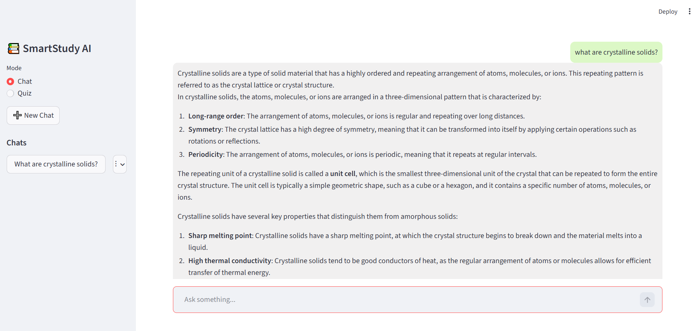
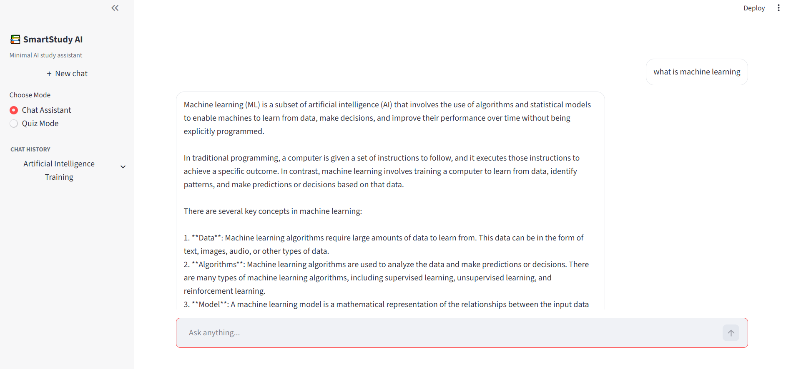
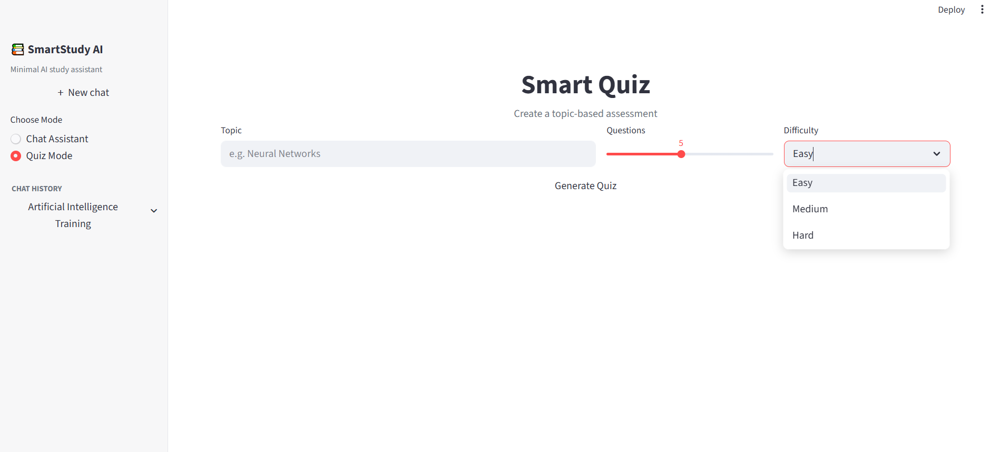
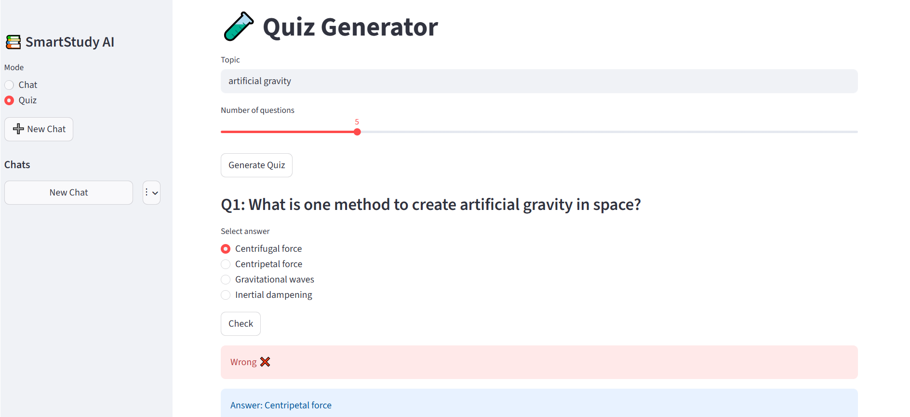
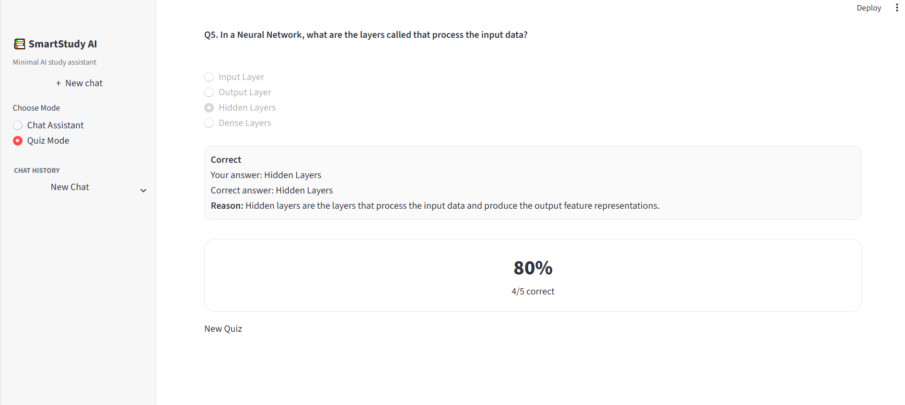

# 📚 SmartStudy AI



An AI-powered study assistant that combines conversational learning with dynamic quiz generation — built for clarity, speed, and real understanding.

---

## Overview

SmartStudy AI is an interactive learning platform where students can:

- Ask questions naturally (like ChatGPT)
- Get clear, structured explanations
- Practice with automatically generated quizzes
- Track multiple study sessions through chat history


## Features

### AI Chat Assistant
- Ask questions in natural language
- Clear, structured explanations (not vague AI replies)
- Adapts tone based on question complexity
- Supports user-defined language (English by default)

## Smart Chat Memory
- Multiple chats 
- Auto-generated chat titles based on first question
- Rename / delete chats
- Smooth sidebar navigation
- Hover-based controls (clean UX — no clutter)

## Dynamic Quiz Generator
- Generate quizzes on any topic
- Select:
- Number of questions
- Difficulty (Easy / Medium / Hard)


### Screenshots








 ## Live Demo
 👉 https://arwaayub-smartstudy.streamlit.app/

## Project structure
SMARTSTUDY-AI/
│
├── app.py                 # Main entry point
│
├── core/                 # Core logic
│   ├── llm.py            # AI communication (Groq API)
│   ├── state.py          # Session state handling
│   └── utils.py          # Helpers (cleaning, formatting)
│
├── features/             # App features
│   ├── chat.py           # Chat system
│   └── quiz.py           # Quiz system
│
├── ui/                   # UI components
│   ├── sidebar.py        # Sidebar + chat history
│   └── styles.py         # Custom styling
│
├── assets/               # Images
├── requirements.txt
└── README.md

---

## Tech Stack

- **Python**
- **Streamlit** (Frontend UI)
- **Groq API (LLaMA 3 models)** (AI engine)
- **dotenv** (environment variable handling)

---

## Setup & Installation

### 1. Clone the repository
```bash
git clone https://github.com/arwa-ayub/SmartStudy-AI.git
cd SmartStudy-AI

### 2.Create virtual environment
python -m venv venv
venv\Scripts\activate

### 3.Install dependenscies
pip install -r requirements.txt

### 4. Setup environment variables
Create a .env file in the root directory:
GROQ_API_KEY=your_api_key_here

⚠️ Do NOT upload this file to GitHub.

### 5.Run the application
```bash
streamlit run app.py


## Future Improvements
User authentication (login system)
Progress tracking dashboard
Save quiz results history
PDF / notes export
Voice input & response
Mobile optimization